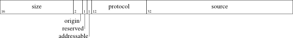
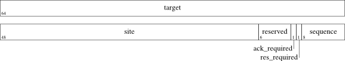

>  [LIFX Developer Home](http://developer.lifx.com) |  [LAN Protocol](README.md). LiFi Labs, Inc. © 2015. All rights reserved. Usage of this documentation is bound by the [LIFX Developer  Terms] (http://developer.lifx.com/terms.html).

# LIFX Protocol V2 Message headers

## Index

* [Overview](#overview)
* [Frame](#frame)
* [Frame Address](#frame-address)
* [Protocol header](#protocol-header)
* [C header declaration](#c-header-declaration)

## Overview

Each LIFX Protocol message has the following format ...

| Frame | Frame Address | Protocol header | Payload |
|-------|---------------|-----------------|---------|

The header is composed of the Frame, Frame Address and Protocol header.
The Payload is covered separately in the documentation for the various
message types.

## Frame

The Frame section contains information about the ...

* Size of the entire message
* LIFX Protocol number: must be 1024 (decimal)
* Use of the Frame Address _target_ field
* Source identifier



| Field | Bits | Type | Description |
|-------|------|------|-------------|
| size | 16 | uint16_t | Size of entire message in bytes including this field |
| origin | 2 | uint8_t | Message origin indicator: must be zero (0) |
| tagged | 1 | bool | Determines usage of Frame Address _target_ field
| addressable | 1 | bool | Message includes a target address: must be one (1) |
| protocol | 12 | uint16_t | Protocol number: must be 1024 (decimal) |
| source | 32 | uint32_t | Source identifier: unique value set by the client, used by responses |

The _tagged_ field is a boolean flag that indicates whether the Frame Address
_target_ field is being used to address an individual device or all devices.
For device discovery using
[Device::GetService](messages/device.md#getservice---2),
the _tagged_ field should be set to one (1) and the _target_ should be all
zeroes.  In all other messages, the _tagged_ field should be set to zero (0)
and the _target_ field should contain the device MAC address. The device will
then respond with a [Device::StateService](messages/device.md#stateservice---3)
message, which will include its own MAC address in the target field. In all
subsequent messages that the client sends to the device, the target field
should be set to the device MAC address, and the tagged field should be set
to zero (0).

The _source_ identifier allows each client to provide an unique value,
which will be included by the LIFX device in any message that is sent in
response to a message sent by the client.
If the _source_ identifier is a non-zero value, then the LIFX device will
send a unicast message to the source IP address and port that the client
used to send the originating message.
If the _source_ identifier is a zero value, then the LIFX device may send
a broadcast message that can be received by all clients on the same sub-net.
See _ack\_required_ and _res\_required_ fields in the Frame Address.

## Frame Address

The Frame Address section contains routing information about the ...

* Target device address
* Acknowledgement message is required flag
* State response message is required flag
* Message sequence number



| Field | Bits | Type | Description |
|-------|------|------|-------------|
| target | 64 | uint64_t | 6 byte device address (MAC address) or zero (0) means all devices |
| reserved | 48 | uint8_t[6] | Must all be zero (0) |
| reserved | 6 | | Reserved |
| ack_required | 1 | bool | Acknowledgement message required |
| res_required | 1 | bool | Response message required |
| sequence | 8 | uint8_t | Wrap around message sequence number |

The _target_ device address is 8 bytes long, when using the 6 byte MAC address
then left-justify the value and zero-fill the last two bytes.
A _target_ device address of all zeroes effectively addresses all devices
on the local network.  The Frame _tagged_ field must be set accordingly.

There are two flags that cause a LIFX device to send a message in response.
In these cases, the _source_ identifier in the response message will be set
to the same value as that in the requesting message sent by the client.

* _ack\_required_ set to one (1) will cause the device to send an
[Device::Acknowledgement](messages/device.md#acknowledgement---45) message
* _res\_required_ set to one (1) within a Set message,
e.g [Light::SetPower](messages/light.md#setpower---117)
will cause the device to send the corresponding State message,
e.g [Light::StatePower](messages/light.md#statepower---118)

The client can use acknowledgements to determine that the LIFX device
has received a message.  However, when using acknowledgements to ensure
reliability in an over-burdened lossy network ... causing additional
network packets may make the problem worse.

Client that don't need to track the updated state of a LIFX device can
choose not to request a response, which will reduce the network burden
and may provide some performance advantage.  In some cases, a device
may choose to send a state update response independent of whether
_res\_required_ is set.

The _sequence_ number allows the client to provide a unique value,
which will be included by the LIFX device in any message that is sent in
response to a message sent by the client.
This allows the client to distinguish between different messages sent with
the same _source_ identifier in the Frame.
See _ack\_required_ and _res\_required_ fields in the Frame Address.

## Protocol header

The Protocol header contains information about the message ...

* Message type which determines what action to take (based on the Payload)


| Field | Bits | Type | Description |
|-------|------|------|-------------|
| reerved | 64 | uint64_t | Reserved |
| type | 16 | uint16_t | Message type determines the payload being used |
| reserved | 16 | | Reserved |

Reserved fields must be set to zero by the client..

## C header declaration

```c
#pragma pack(push, 1)
typedef struct {
  /* frame */
  uint16_t size;
  uint16_t protocol:12;
  uint8_t  addressable:1;
  uint8_t  tagged:1;
  uint8_t  origin:2;
  uint32_t source;
  /* frame address */
  uint8_t  target[8];
  uint8_t  reserved[6];
  uint8_t  res_required:1;
  uint8_t  ack_required:1;
  uint8_t  :6;
  uint8_t  sequence;
  /* protocol header */
  uint64_t :64;
  uint16_t type;
  uint16_t :16;
  /* variable length payload follows */
} lx_protocol_header_t;
#pragma pack(pop)
```

Numeric data-type byte-order is
[little-endian](http://en.wikipedia.org/wiki/Endianness#Little-endian),
which means that dumping serialized data structures or viewing network
packet sniffing may show the content of numeric fields in reversed
byte-order.
