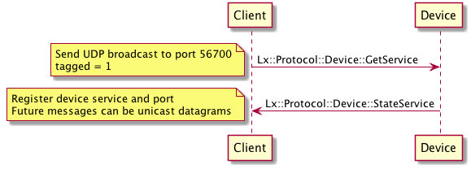
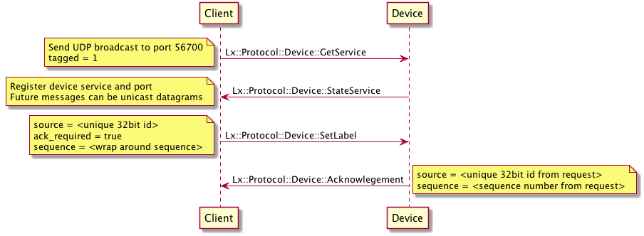
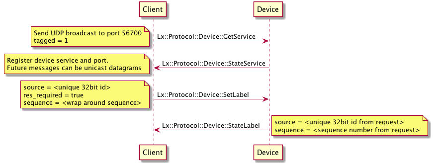
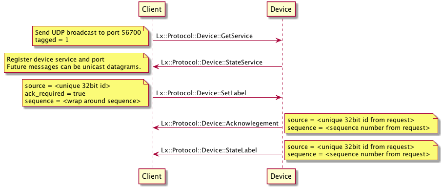

>  [LIFX Developer Home](http://developer.lifx.com) |  [LAN Protocol](README.md). LiFi Labs, Inc. © 2015. All rights reserved. Usage of this documentation is bound by the [LIFX Developer  Terms] (http://developer.lifx.com/terms.html).

# LIFX Protocol V2 Message workflows

## Index

* [Discovery](#discovery)
* [Request with acknowledgement](#request-with-acknowledgement)
* [Request with response](#request-with-response)
* [Request with acknowledgement and response](#request-with-acknowledgement-and-response)

## Discovery

1. Send [Device::GetService](messages/device.md#getservice---2)
as a UDP broadcast to port 56700 with the [Frame](header.md#frame)
_tagged_ field set to one (1).
2. All devices on LAN should respond back with one or more
[Device::StateService](messages/device.md#stateservice---3) messages.
3. Clients can then send further messages directly to individual devices or
broadcast them.

## Request with acknowledgement

1. Discover devices as above.
2. Set the source field with a unique 32-bit number,
it does not have to be globally unique.
3. Use the wrap around sequence as a message id.
4. Set the ack_required field to 1
5. Send message and it is acknowledged with
[Device::Acknowledgement](messages/device.md#acknowledgement---45)
having same source and sequence.

## Request with response

1. Discover devices as above.
2. Set the source field with a unique 32-bit number,
it does not have to be globally unique.
3. Use the wrap around sequence as a message id.
4. Set the res_required field to 1
5. Send message and a corresponding semantic reply is sent back
having same source and sequence.

## Request with acknowledgement and response

1. This is a mix of the above 2 workflows.
2. The device sends back an acknowledgement initially and
then a corresponding semantic reply.

